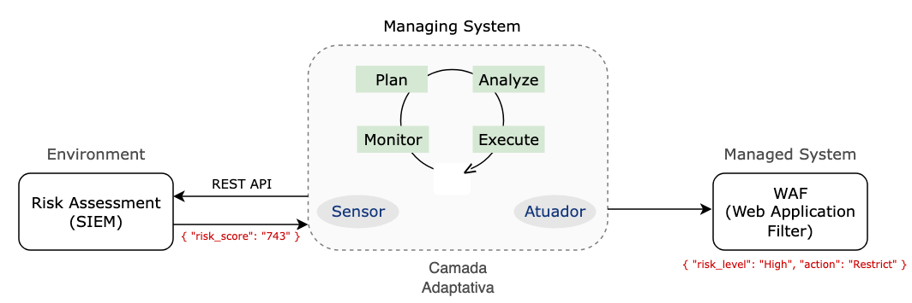

# Aplicação Mape-K

Esse é um protótipo simples de uma aplicação adaptativa utilizando o framework [PyMAPE](https://elbowz.github.io/PyMAPE/) que permite o desenvolvimento e implementação de sistemas autônomos (Self-Adaptive) `MonitorAnalyzePlanExecute-Knowledge` distribuídos e descentralizados. 

<p align="center"></p>
### MAPE-K loop

Um sistema pode se tornar auto-adaptativo adicionando **sensores** para monitorar seu estado de execução, **atuadores** para alterá-lo em tempo de execução e um mecanismo de **raciocínio** separado para decidir quando é apropriado **adaptar** o sistema e qual a melhor forma de fazê-lo.


##### Componentes

- `Monitor`: Monitora o sistema gerenciado e seu contexto, filtre os dados coletados e armazena eventos relevantes no `Knowledge`.

- `Analyze`: Explora os dados, comparando-os com padrões conhecidos, identificando quaisquer sintomas e salvando-os no Knowledge conforme necessário.

- `Plan`: Interpreta os sintomas e elabora um plano para alcançar a adaptação (ou objetivo), geralmente de acordo com diretrizes e estratégias.

- `Execute`: Fornece os mecanismos de controle para garantir a execução do plano no sistema gerenciado.

- `Knowledge`: Contém informações do sistema gerenciado que podem ser compartilhadas entre todos os componentes do MAPE. Contém todo o conhecimento útil para o loop (ex. representação, políticas a seguir, métricas para avaliação, regras de inferência específicas para cada tarefa, histórico, estratégias de adaptação, topologia do sistema, etc).

--- 

### Protótipo

Para ilustrar a implementação de um sistema adaptativo utilizando o PyMAPE, consideraremos um cenário onde as políticas de acesso de um [WAF](https://www.cloudflare.com/learning/ddos/glossary/web-application-firewall-waf/) (Web Application Firewall) precisa se adaptar dinamicamente baseado na inferência de risco realizada pela `engine` de *threat assessment* existente em um [SIEM](https://www.ibm.com/topics/siem) e acessível via REST API.



O fluxo de adaptação ocorrerá na seguinte sequência:

* A camada adaptativa é implementada como um *control loop* enviando requisições REST API para o SIEM de modo a obter o mais recente *risk_score*, cuja inferência é baseada no volume de requisições HTTP/HTTPS caracterizadas como ameaças (eg. `{ "risk_score": "743" }`.

```
@loop.monitor #
def detect(risk, on_next): #
    on_next(risk)
```

* O componente de monitoração (**monitor**) receberá a inferência coletada e encaminhará os dados para a camada de planejamento e análise. No caso de uso em questão a análise executada baseada em `ranges` predeterminados que estão associados ao risco. 

```python
...
# PLAN
@loop.plan(uid='custom_policy') #
def policy(risk, on_next, self):
...
policy.critical_risk_range = range(750, 1000)
policy.high_risk_range = range(500, 749)
policy.medium_risk_range = range(250, 499)
...
```

* Caso haja necessidade de adaptação do sistema gerenciado, a camada de adaptação será responsável pela execução através dos atuadores, cuja adaptação poderá ser realizada utilizando diferente métodos (*pull*, *push*, camada de persistência, etc).

```python
# EXECUTE
@loop.execute
def exec(item, on_next):
...
```

--- 
### Executar

- Inicie o container:

```
$ docker run -d --name pymap-risk-k hutger/pymape-risk-k:latest
```

- Acesse os logs

```
$ docker logs pymap-risk-k --follow
...
----
2023-04-16 10:54:50.925815
Risk Level: Critical
Public Access: Blocked
----

----
2023-04-16 10:54:53.183991
Risk Level: Critical
Public Access: Blocked
----

----
2023-04-16 10:54:54.312169
Risk Level: High
Public Access: Blocked
----

----
2023-04-16 10:54:55.437568
Risk Level: Low
Public Access: Allowed
----

----
2023-04-16 10:54:56.558710
Risk Level: Critical
Public Access: Blocked
----
...
```

 


### Distribuído e Descentralizado

Um ponto importante do PyMAPE é a capacidade de descentralizar (funcionalidades e dados) e distribuir loops em mais dispositivos. 

Existem prós e contras na utilização de diferentes arquiteturas de comunicação com base em `request-response` (eg. *polling*) respect to `publish-subscribe` (eg. *data centralization*), cuja melhor opção depende do contexto. Você pode escolher entre:

- Implementação **RESTful**, permitindo acesso de leitura e escrita aos elementos da sua aplicação


- **Redis** como BD e message broker, permitindo a comunicação entre elementos e também como memória compartilhada (Knowledge) para nós de distribuição.

--- 

### Referências

- Source Code: [https://github.com/elbowz/PyMAPE](https://github.com/elbowz/PyMAPE)
- Documentation: [https://elbowz.github.io/PyMAPE](https://elbowz.github.io/PyMAPE)